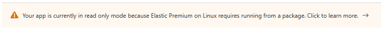

# Terraform - Azure - Secure Function App

This repository contains an example Terraform implementation for a Function App running on a virtual network (VNet) integrated app service and private endpoint protected storage.

This implementation assumes the following, however, considerations have been listed below to aid decision making:

* Linux is the target operating system
* Elastic Premium (EP1, EP2, EP3) is the target plan SKU
* Azure DNS is being used

---

## Storage Considerations - Azure Files

The use of Azure Files to store and run the function app code is a muddied one with the amount of GitHub issues around private endpoints and app settings such as `WEBSITE_CONTENTSHARE`, `WEBSITE_CONTENTAZUREFILECONNECTIONSTRING` and `WEBSITE_CONTENTOVERVNET`.

The considerations when creating an app without Azure files are documented [here.](https://learn.microsoft.com/en-us/azure/azure-functions/storage-considerations?tabs=azure-cli#create-an-app-without-azure-files).

The key design decision for using Azure Files or not has a couple of elements; generally the topic comes about when deploying in a network-secured environment where the storage account is protected by private endpoints or when the app service plan is one of the Elastic Premium options in combination with Linux. You may have seen this message before:

As such; if we consider the above message and are targeting Linux and Elastic Premium plans; we do not need to mess with the content app settings and instead move to the next consideration around running from a package.

If we were targeting Windows then we have the option of using Azure Files or running from a package; for Azure Files we can set the `WEBSITE_CONTENTSHARE`, `WEBSITE_CONTENTAZUREFILECONNECTIONSTRING` and `WEBSITE_CONTENTOVERVNET` app settings.

Topic Links:

* <https://learn.microsoft.com/en-us/azure/azure-functions/storage-considerations?tabs=azure-cli>

---

## Storage Considerations - On-Site Package and Blob

There are a bunch of [benefits](https://learn.microsoft.com/en-gb/azure/azure-functions/run-functions-from-deployment-package#benefits-of-running-from-a-package-file) for running from a package and [general considerations](https://learn.microsoft.com/en-gb/azure/azure-functions/run-functions-from-deployment-package#general-considerations). Here we are focusing on the specifics of *how* to implement running from a package: `WEBSITE_RUN_FROM_PACKAGE = 1` or `WEBSITE_RUN_FROM_PACKAGE = URL`.

`WEBSITE_RUN_FROM_PACKAGE = 1` is the recommended option when using `Elastic Premium` and `Linux` as the `URL` option is *only* recommended when using Linux and Consumption.

Additionally, using [Zip Deployment](https://learn.microsoft.com/en-gb/azure/azure-functions/run-functions-from-deployment-package#integration-with-zip-deployment) is the recommended deployment mechanism.

Topic Links:

* <https://learn.microsoft.com/en-gb/azure/azure-functions/run-functions-from-deployment-package>
* <https://learn.microsoft.com/en-gb/azure/azure-functions/deployment-zip-push>

---

## Plan Considerations

For VNet integration we need to use either the Elastic Plans or the Dedicated Premium plans. Elastic Premium fits most common scenarios whilst being scalable with the premium features required.

Topic Links:

* <https://learn.microsoft.com/en-us/azure/azure-functions/functions-scale>
* <https://learn.microsoft.com/en-us/azure/azure-functions/functions-premium-plan?tabs=portal>

---

## Terraform Resources

* [service_plan]([azurerm_service_plan](https://registry.terraform.io/providers/hashicorp/azurerm/latest/docs/resources/service_plan))
* [linux_function_app](https://registry.terraform.io/providers/hashicorp/azurerm/latest/docs/resources/linux_function_app)
* [windows_function_app](https://registry.terraform.io/providers/hashicorp/azurerm/latest/docs/resources/windows_function_app)

---

## Other Useful Links

* <https://learn.microsoft.com/en-us/azure/azure-functions/functions-app-settings>
* <https://github.com/projectkudu/kudu/wiki/WEBSITE_RUN_FROM_PACKAGE-and-WEBSITE_CONTENTAZUREFILECONNECTIONSTRING-Best-Practices>
* <https://learn.microsoft.com/en-gb/azure/azure-functions/performance-reliability>
* <https://learn.microsoft.com/en-us/azure/azure-functions/functions-recover-storage-account>